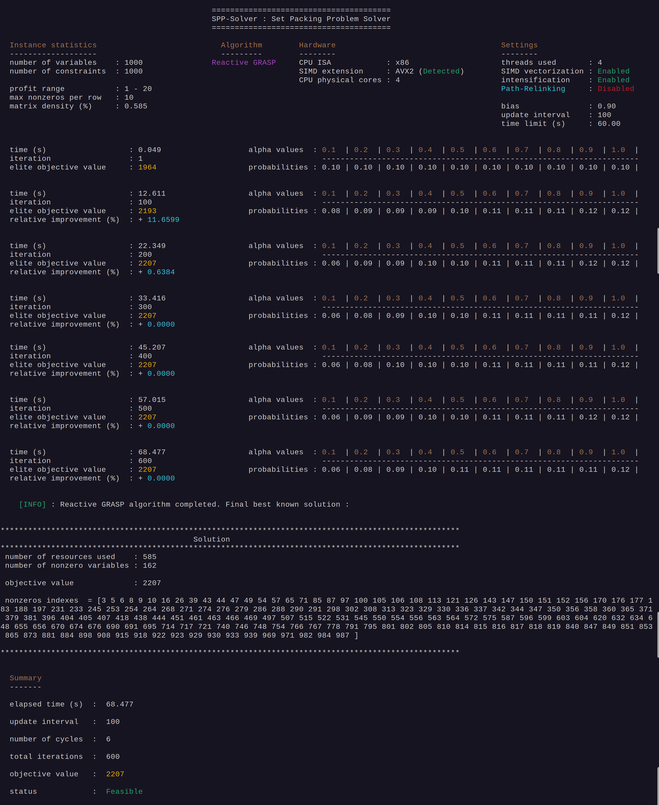
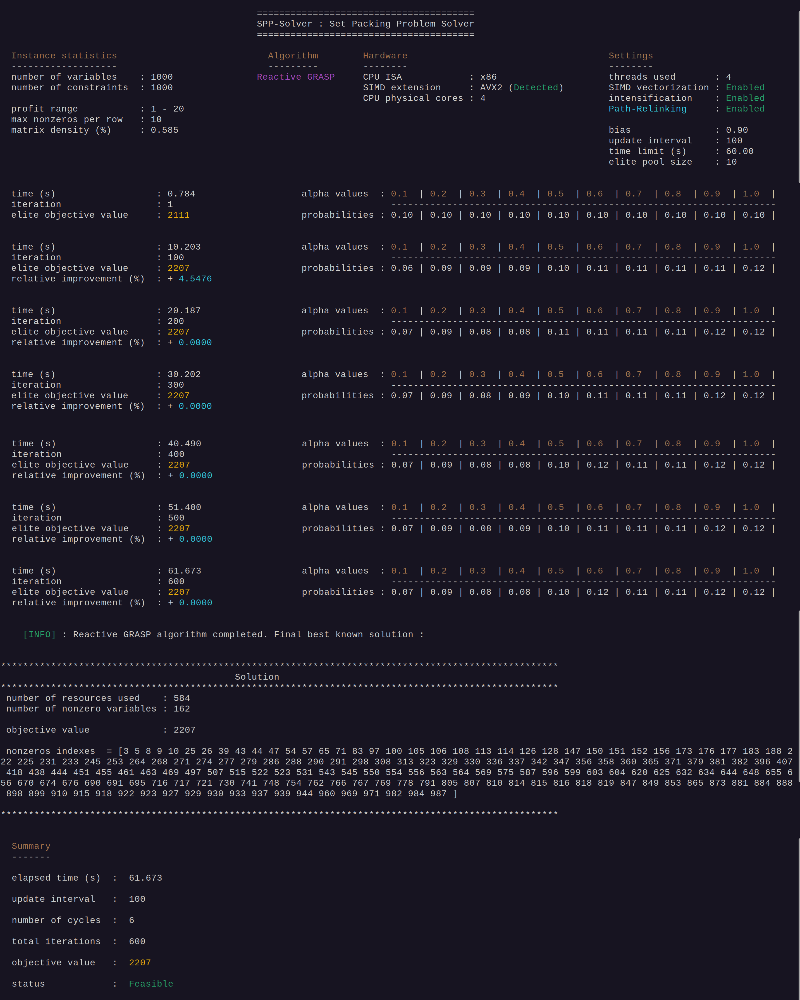
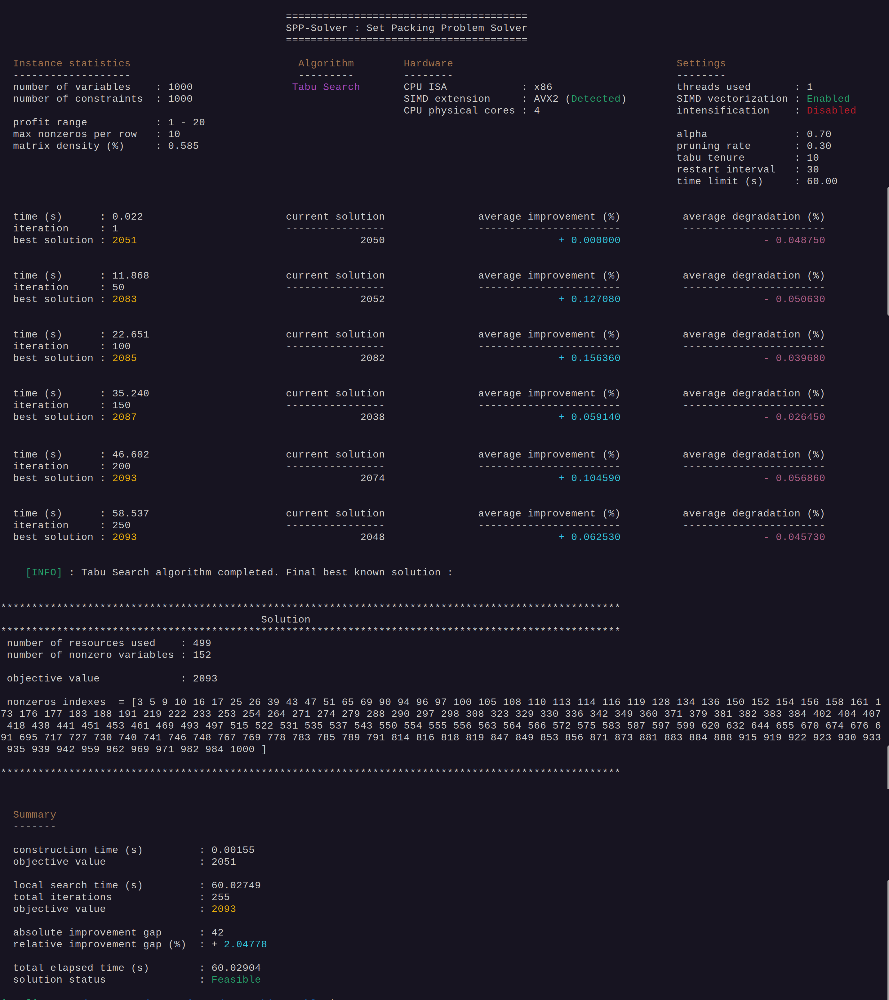
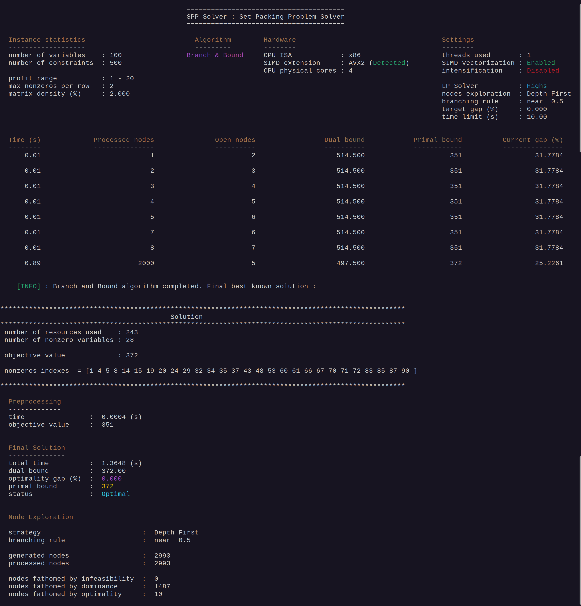
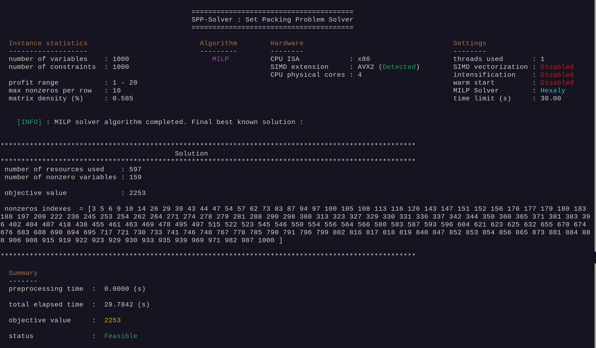

# Introduction

The Set Packing Problem (SPP) is an **NP-hard** combinatorial optimization problem that consists in selecting a subset of **activities** competing for **non-shareable resources** in order to **maximize** the total profit.


# Mathematical Formulation


# Resolution methods

This solver integrates a set of complementary methods for the Set Packing Problem (SPP), including monotonic and non‑monotonic local search, evolutionary procedures, selection‑based hyper‑heuristics and exact techniques. Its HPC design relies on compact BitVector representations, loop unrolling, SIMD vectorization and multithreading to ensure efficient large‑scale optimization.


## 1. Deterministic Greedy Construction

Builds a feasible solution by iteratively selecting the activity with the highest **heuristic score**, then discarding all resource‑conflicting activities to maintain feasibility.

## 2. Neighboorhood Operators

- **0-1 exchange** : activates a currently inactive variable (0 $\rightarrow$ 1) while preserving feasibility.


- **1-1 exchange** : replaces an active variable with an inactive one (1 $\rightarrow$ 0 and 0 $\rightarrow$ 1) while preserving feasibility.


- **1-2 exchange** : deactivates one active variable (1 $\rightarrow$ 0) and activates two inactive variables (0 $\rightarrow$ 1, 0 $\rightarrow$ 1) while preserving feasibility.


- **2-1 exchange** : deactivates two active variables (1 $\rightarrow$ 0, 1 $\rightarrow$ 0) and activates one inactive variable (0 $\rightarrow$ 1) while maintaining feasibility.


## 3. Variable Neighborhood Descent (VND)

Two VND strategies are available:

- **Classical VND** : applies neighborhoods in the order 1‑2 $\rightarrow$ 1‑1 $\rightarrow$ 2‑1 $\rightarrow$ 0‑1.
This variant is extremely fast and evaluates each neighborhood until no further improvement is possible.

- **Intensified VND** : applies neighborhoods in the order 1‑1 $\rightarrow$ 1‑2 $\rightarrow$ 2‑1 $\rightarrow$ 0‑1.
It produces slightly better solutions on most difficult benchmark instances (notably *pb_1000rnd0700.dat* and *pb_2000rnd0700.dat*), but requires significantly more exploration time.


Although the intensified strategy often yields better results on challenging cases, it does not systematically outperform the classical VND — which is the default mode and remains highly competitive thanks to its exceptional speed.


## 4. Reactive Greedy Randomized Adaptive Search Procedure (Reactive GRASP)


The Reactive GRASP uses a **discrete set of 10 $\alpha$‑values**, each controlling the **balance between greediness and randomness** during construction.
Each constructed solution is systematically **refined through a Variable Neighborhood Descent** (VND) local search, ensuring that the adaptive mechanism evaluates the true performance of every $\alpha$  under full improvement.

After a **fixed number of iterations** (update interval), the solver computes the **average performance** obtained by each $\alpha$ and updates their selection probabilities adaptively.
A **bias parameter** reinforces the most effective $\alpha$‑values, increasing their probability while maintaining controlled exploration across all candidates.


## 5. Path-Relinking intensification (for the Reactive GRASP algorithm)

During each GRASP cycle, the solver generates many candidate solutions and retains only a **restricted elite pool**. The **best solution in this pool** becomes the **guiding solution**.

Path‑Relinking then performs i**ndependent parallel explorations** between the guiding solution and each remaining elite. Along each path, whenever an **intermediate solution** becomes **better than the guiding solution**, an **intensified VND is applied** — even if this intermediate solution is **not better than the best elite currently found** along that path.
This allows the algorithm to exploit promising states early and potentially uncover stronger elites.

The best result obtained across all paths is returned as the **intensified elite** for the cycle.


## 6. Tabu Search (multi-neighborhood, pruning and periodic restart)

The Tabu Search implemented in this solver relies on a multi‑neighborhood exploration, using the four operators previously defined: 1‑2, 1‑1, 2‑1 and 0‑1.
At each iteration, the algorithm evaluates the best admissible move across all neighborhoods, while **respecting the tabu list**.

To avoid the **combinatorial explosion** inherent to the 1‑2 and 2‑1 neighborhoods, the solver applies **selective pruning** : only the most promising candidate combinations (according to an internal heuristic score) are evaluated.

In addition to this filtering, the inner loops of these neighborhoods are pruned using linear or quadratic bounds, depending on the structure of the move:

- the outer loop over deactivated variables is restricted by a quadratic decay bound, reducing the number of candidates as their heuristic score decreases;

- the inner loop over activated variables uses a linear pruning rule, dynamically adjusting the exploration range based on the relative position of the variable in the sorted list.

These pruning strategies drastically reduce the number of evaluated combinations while preserving strong exploration capabilities, making multi‑neighborhood Tabu Search feasible even on large‑scale SPP instances.


To introduce diversification, each Tabu Search phase starts from a **randomized construction** similar to the one used in Reactive GRASP. In addition, a periodic restart further enhances diversification : after a fixed number of iterations (**restart interval**), the solver rebuilds a new randomized initial solution and resets the tabu list. This mechanism helps the algorithm escape local optima and improve robustness on difficult benchmark instances.


## 9. Branch & Bound


An **exact** Branch & Bound method with **optimality guarantee**.  
The search is warm‑started using the **deterministic greedy construction with VND local search**, providing a strong initial primal bound and improving pruning efficiency.  Linear relaxations are solved through the selected Linear Programming solver backend, with configurable branching rules and exploration strategies.


## 10. MILP Solvers interfaces

This project includes lightweight interfaces to **HiGHS**, **Gurobi** and **Hexaly** for solving the Set Packing Problem as a Mixed-Integer Linear Program (MILP).  
These interfaces build the SPP model, call the solver and then extract the resulting solution.


## 11. High‑Performance Computing (HPC) Enhancements

Since both the decision variables and the constraint matrix are purely binary, the solver uses a **compact BitVector representation** to efficiently encode solutions and conflicts.
This enables fast bitwise operations for feasibility checks and neighborhood evaluation.

To further accelerate computation, the solver integrates **SIMD (Single Instruction, Multiple Data)** vectorization, **loop unrolling** and **CPU multi‑threading**.

These HPC techniques significantly reduce the cost of conflict detection and neighborhood exploration, especially on large and sparse SPP instances.


# Benchmark Instances


All benchmark instances used in this project come from the well‑known **Set Packing Problem (SPP)** library introduced by **Xavier Delorme & Xavier Gandibleux** as part of their work on railway capacity evaluation and combinatorial optimization.

[Benchmark SPP – Delorme & Gandibleux](https://www.emse.fr/%7Edelorme/SetPacking.html#BOSPP)

This dataset is widely used in the literature for evaluating heuristics, metaheuristics and exact methods for the **Set Packing Problem**.  
It contains **64 mono‑objective instances**, generated with controlled parameters (number of variables, number of constraints, density, and maximum number of non‑zero coefficients per constraint).  
These instances range from **small and easy** (100 variables) to **very large and challenging** (2000 variables and up to 10 000 constraints).

In particular, instances with **low density** and **high Max‑One values**—such as *pb_1000rnd0700* and *pb_2000rnd0700*—are known to be among the most difficult and are commonly used to stress‑test construction heuristics, local search procedures and exact solvers.


>**Note** : **All instances follow the same standardized SPP input format and the SPP‑Solver is designed to read this format directly without any preprocessing**.


# Dependencies :

> **Note** : The solver is designed for Linux and macOS systems and supports both **x86‑64** and **ARMv8** architectures.  
> SIMD acceleration relies on **AVX2** on x86 processors and **NEON** on ARM processors. A minimum of **ARMv8** is required to ensure 64‑bit NEON support.


### Mandatory : 

- meson (at least 1.5.1)
- ninja (at least 1.11.1)
- g++ (C++20)


### MILP SOLVERS :

To enable the Branch and Bound algorithm or Milp backends, you must have at least one of : 

- Highs (open source)
- Hexaly (commercial, licence required)
- Gurobi (commercial, licence required)


# Installation : 

## 1. Clone the repository

```bash
git clone https://github.com/Josue-Tambwe/SetPackingProblem.git
```

## 2. Move into the project directory

```bash
cd SetPackingProblem

```

## 3. Make the installation script executable


 ```bash
 chmod +x install.sh 
```
## 4. Run the installation script

Without MILP solvers : 

```bash
./install.sh
```
___

If you have MILP solvers installed, define the environment variables pointing to their installation folders : 

- GUROBI_HOME $\rightarrow$ for Gurobi
- HX_HOME $\rightarrow$ for Hexaly
- Highs does not require an environment variable

### Example on Linux
```bash
# Gurobi
export GUROBI_HOME=/home/<user>/gurobi1300/linux64
export PATH="$PATH:$GUROBI_HOME/bin"
export LD_LIBRARY_PATH="$LD_LIBRARY_PATH:$GUROBI_HOME/lib"

# Hexaly
export HX_HOME=/home/<user>/hexaly_14_5
export PATH="$PATH:$HX_HOME/bin"
export LD_LIBRARY_PATH="$LD_LIBRARY_PATH:$HX_HOME/bin"
```


### Example on MacOS

```bash
# Gurobi
export GUROBI_HOME=/Library/gurobi1300/macos_universal2
export PATH="$PATH:$GUROBI_HOME/bin"
export DYLD_LIBRARY_PATH="$DYLD_LIBRARY_PATH:$GUROBI_HOME/lib"

# Hexaly
export HX_HOME=/Users/<user>/hexaly_14_5
export PATH="$PATH:$HX_HOME/bin"
export DYLD_LIBRARY_PATH="$DYLD_LIBRARY_PATH:$HX_HOME/bin"
```

You can add these lines to your `~/.bashrc` or `~/.zshrc` (depending on your shell) to make them persistent.

> **Note:** Adapt those lines to your versions installed of **Gurobi** and **Hexaly**. In addition, once the project is compiled, you can choose the MILP solver at runtime.  GAP‑Solver does not hard‑code a specific backend: the solver is selected dynamically based on the command‑line options you provide when running the executable.


Then run the installer with the backends you want to enable : 

```bash
./install.sh HAS_GUROBI HAS_HEXALY HAS_HIGHS
```
___


# Usage / CLI examples

The executable is located in the **bin/** directory after installation.


## Display the help message

```bash
./bin/spp_solver --help
```


## Run Greedy algorithm (deterministic construction + VND local search)

```bash
./bin/spp_solver --algorithm=greedy --instance=benchmarks/pb_1000rnd0700.dat --simd --verbose 
```
- **--simd** (optional) : Activates SIMD‑optimized kernels for fast feasibility evaluation in local search neighborhoods.


- **--verbose** (optional) : Prints neighborhood exploration details.

- **--intensification** (optional) : Enables intensified VND local search.


## Run Reactive GRASP algorithm (randomized construction + VND local search)

```bash
./bin/spp_solver --algorithm=grasp --instance=benchmarks/pb_1000rnd0700.dat --update-interval=100 --time-limit=60 --bias=0.9 --nb-threads=4 --simd --intensification
```

- **--update-interval** (mandatory) : Number of iterations between two probability updates of the 10 $\alpha$‑values.

- **--biais** (optional) : Controls how strongly the probability update favors the best‑performing $\alpha$‑values.

- **--time-limit** (optional) : Maximum runtime in seconds.


- **--nb-cycles** (optional) : Number of update cycles to execute. Each cycle runs update-interval iterations, followed by an adaptive probability update.

Total GRASP iterations = update-interval $\times$ nb-cycles.

- **--nb-threads** (optional) : Number of CPU threads used to accelerate the execution of the update-interval iterations inside each GRASP cycle. By default, the solver uses the number of physical CPU cores.

- additional options : **--simd** and **--intensification**




## Run Reactive GRASP algorithm with Path-Relinking intensification


```bash
./bin/spp_solver --algorithm=grasp --instance=benchmarks/pb_1000rnd0700.dat --update-interval=100 --time-limit=60 --bias=0.9 --nb-threads=4 --simd --intensification  --path-relinking  --nb-elites=10
```

- **--path-relinking** (mandatory) : Enable the path-relinking intensification phase.

- **--nb-elites** (optional) : Defines the size of the elite pool retained during each GRASP cycle. If omitted, the solver defaults to the number of physical CPU cores




## Tabu Search with greedy randomized construction


```bash
./bin/spp_solver --algorithm=ts --instance=benchmarks/pb_1000rnd0700.dat --simd --verbose --pruning-rate=0.3 --time-limit=60 --tabu-tenure=10 --alpha=0.7 --restart-interval=30
```

- **--tabu-tenure** (mandatory) : Length of time a move stays tabu. Higher values increase diversification.

- **--restart-interval** (mandatory) : Number of iterations before restarting Tabu Search from a new randomized construction. The tabu list is reset at each restart.


- **--alpha** (optional) : in \[0,1] controls randomness in the greedy construction used at each restart. $\alpha$ close to zero is highly random and $\alpha$  close to one is highly greedy.


- **--pruning-rate** (optional) : in \[0,1] is the proportion of the top‑scored inactive variables considered in the 1‑2 and 2‑1 neighborhoods. Higher values explore more inactive **elite** candidates; lower values prune aggressively and reduce the combinatorial cost.

- additional options : **--simd** and **--intensification**




## Run Branch & Bound algorithm (with greedy primal solution)

```bash
./bin/spp_solver --instance=benchmarks/pb_100rnd0100.dat --algorithm=bab --solver=highs --exploration=dfs --branching-rule=fractional --gap=0.00 --simd --time-limit=10 
```

- **--branching-rule** (optional) : Selects the branching variable strategy.

- **--exploration** (optional) : Node exploration mode (Best First or Depth First).

- **--gap** (optional) : Target optimality gap.

- **--solver** (mandatory) : Selects the solver for the Linear Relaxation (Gurobi or Highs).

- additional options : **--simd** , **--intensification** and **--time-limit=value**





## Run MILP Backend Solvers

```bash
./bin/spp_solver --algorithm=milp --instance=benchmarks/pb_1000rnd0700.dat  --solver=hexaly --time-limit=30 
```

- **--solver** (mandatory) : Selects the solver for the Mixed-Integer Linear Programming resolution approach (Gurobi, Hexaly or Highs) .

- **--time-limit** (optional) : Maximum runtime in seconds.

- **--warm-start** (optional) : Provide an starting point to the MILP Solver.

>**Note** :  **MILP solvers do not require an initial feasible solution to start the optimization process**.
>This feature was implemented to evaluate whether providing a warm start could help the solver prune suboptimal branches earlier and accelerate the search.


- additional options : **--simd** and **--intensification** only when **--warm-start** option is enabled




# References

The theoretical foundations and algorithmic components implemented in this solver rely on established works in combinatorial optimization and metaheuristics. Key references include :


- **Xavier Delorme, Xavier Gandibleux, Joaquin Rodriguez** — *GRASP for Set Packing Problems*.  
  *European Journal of Operational Research*, 153(3), 564–580, 2004.


- **Xavier Delorme** — *Modélisation et résolution de problèmes liés à l’exploitation d’infrastructures ferroviaires*.  
  PhD Thesis, Université de Valenciennes, 2003.


- **Jacques Teghem** — *Recherche Opérationnelle, Tome 1*.  
  Éditions Ellipses, 2012.


- **Pierre Hansen, Nenad Mladenović, Jack Brimberg, José A. Moreno Pérez** — *Variable Neighborhood Search*.  
  In **Handbook of Metaheuristics**, International Series in Operations Research & Management Science, vol. 146, Springer, 2010.


- **Mauricio G.C. Resende, Celso C. Ribeiro** — *Greedy Randomized Adaptive Search Procedures: Advances, Hybridizations, and Applications*.  
  In *Handbook of Metaheuristics*, International Series in Operations Research & Management Science, vol. 146, Springer, 2010.


- **Fred Glover, Manuel Laguna** — *Tabu Search*.  
  In *Handbook of Combinatorial Optimization*, 2nd Edition, Panos Pardalos, Ding-Zu Du, Ronald Graham (eds.), Springer, 2013.


- **Edmund K. Burke, Michel Gendreau, Matthew Hyde, Graham Kendall, Gabriela Ochoa, Ender Özcan, Rong Qu** — *Hyper‑heuristics: A Survey of the State of the Art*.  
  *Journal of the Operational Research Society*, 2013.
  

- **Johann Dréo, Alain Petrowski, Patrick Siarry, Éric Taillard** — *Métaheuristiques pour l’optimisation difficile*.  
  Eyrolles, 2006.


