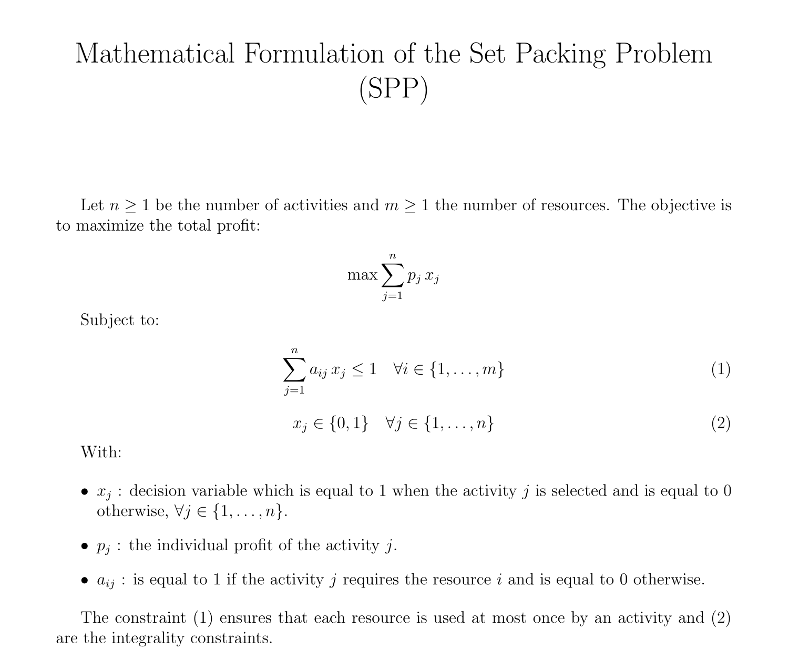
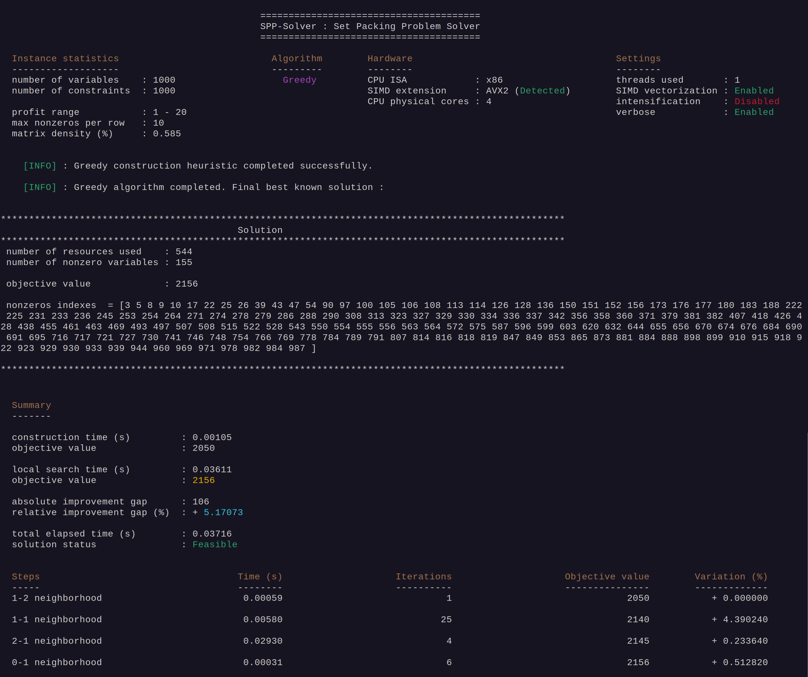

# Introduction

The Set Packing Problem (SPP) is an **NP-hard** combinatorial optimization problem that consists in selecting a subset of **activities** competing for **non-shareable resources** in order to **maximize** the total profit.


# Mathematical Formulation




# Resolution methods

This solver integrates a set of complementary methods for the Set Packing Problem (SPP), including monotonic and non‑monotonic local search, evolutionary procedures, selection‑based hyper‑heuristics, and exact techniques. Its HPC design relies on compact BitVector representations, loop unrolling, SIMD vectorization, and multithreading to ensure efficient large‑scale optimization.


## 1. Deterministic Greedy Construction

Builds a feasible solution by iteratively selecting the activity with the highest **heuristic score**, then discarding all resource‑conflicting activities to maintain feasibility.

## 2. Neighboorhood Operators

- **0-1 exchange** : activates a currently inactive variable (0 $\rightarrow$ 1) while preserving feasibility.


- **1-1 exchange** : replaces an active variable with an inactive one (1 $\rightarrow$ 0 and 0 $\rightarrow$ 1) while preserving feasibility.


- **1-2 exchange** : deactivates one active variable (1 $\rightarrow$ 0) and activates two inactive variables (0 $\rightarrow$ 1, 0 $\rightarrow$ 1) while preserving feasibility.


- **2-1 exchange** : deactivates two active variables (1 $\rightarrow$ 0, 1 $\rightarrow$ 0) and activates one inactive variable (0 $\rightarrow$ 1) while maintaining feasibility.


## 3. Variable Neighborhood Descent (VND)

Two VND strategies are available:

- **Classical VND** : applies neighborhoods in the order 1‑2 $\rightarrow$ 1‑1 $\rightarrow$ 2‑1 $\rightarrow$ 0‑1.
This variant is extremely fast and evaluates each neighborhood until no further improvement is possible.

- **Intensified VND** : applies neighborhoods in the order 1‑1 $\rightarrow$ 1‑2 $\rightarrow$ 2‑1 $\rightarrow$ 0‑1.
It produces slightly better solutions on most difficult benchmark instances (notably *pb_1000rnd0700.dat* and *pb_2000rnd0700.dat*), but requires significantly more exploration time.


Although the intensified strategy often yields better results on challenging cases, it does not systematically outperform the classical VND — which is the default mode and remains highly competitive thanks to its exceptional speed.


## 9. High‑Performance Computing (HPC) Enhancements

Since both the decision variables and the constraint matrix are purely binary, the solver uses a **compact BitVector representation** to encode solutions and conflicts efficiently.
This enables fast bitwise operations for feasibility checks and neighborhood evaluation.

To further accelerate computation, the solver integrates **SIMD (Single Instruction, Multiple Data)** vectorization, **loop unrolling**, and **CPU multi‑threading**.

These HPC techniques significantly reduce the cost of conflict detection and neighborhood exploration, especially on large and sparse SPP instances.


# Benchmark Instances


All benchmark instances used in this project come from the well‑known **Set Packing Problem (SPP)** library introduced by **Xavier Delorme & Xavier Gandibleux** as part of their work on railway capacity evaluation and combinatorial optimization.

[Benchmark SPP – Delorme & Gandibleux](https://www.emse.fr/%7Edelorme/SetPacking.html#BOSPP)

This dataset is widely used in the literature for evaluating heuristics, metaheuristics, and exact methods for the **Set Packing Problem**.  
It contains **64 mono‑objective instances**, generated with controlled parameters (number of variables, number of constraints, density, and maximum number of non‑zero coefficients per constraint).  
These instances range from **small and easy** (100 variables) to **very large and challenging** (2000 variables and up to 10 000 constraints).

In particular, instances with **low density** and **high Max‑One values**—such as *pb_1000rnd0700* and *pb_2000rnd0700*—are known to be among the most difficult and are commonly used to stress‑test construction heuristics, local search procedures, and exact solvers.


>**Note** : **All instances follow the same standardized SPP input format, and the SPP‑Solver is designed to read this format directly without any preprocessing**.


# Dependencies :

> **Note** : The solver is designed for Linux and macOS systems and supports both **x86‑64** and **ARMv8** architectures.  
> SIMD acceleration relies on **AVX2** on x86 processors and **NEON** on ARM processors. A minimum of **ARMv8** is required to ensure 64‑bit NEON support.


### Mandatory : 

- meson (at least 1.5.1)
- ninja (at least 1.11.1)
- g++ (C++20)


### MILP SOLVERS :

To enable the Branch and Bound algorithm or Milp backends, you must have at least one of : 

- Highs (open source)
- Hexaly (commercial, licence required)
- Gurobi (commercial, licence required)


# Installation : 

## 1. Clone the repository

```bash
git clone https://github.com/Josue-Tambwe/SetPackingProblem.git
```

## 2. Move into the project directory

```bash
cd SetPackingProblem

```

## 3. Make the installation script executable


 ```bash
 chmod +x install.sh 
```
## 4. Run the installation script

Without MILP solvers : 

```bash
./install.sh
```
___

If you have MILP solvers installed, define the environment variables pointing to their installation folders : 

- GUROBI_HOME $\rightarrow$ for Gurobi
- HX_HOME $\rightarrow$ for Hexaly
- Highs does not require an environment variable

### Example on Linux
```bash
# Gurobi
export GUROBI_HOME=/home/<user>/gurobi1300/linux64
export PATH="$PATH:$GUROBI_HOME/bin"
export LD_LIBRARY_PATH="$LD_LIBRARY_PATH:$GUROBI_HOME/lib"

# Hexaly
export HX_HOME=/home/<user>/hexaly_14_5
export PATH="$PATH:$HX_HOME/bin"
export LD_LIBRARY_PATH="$LD_LIBRARY_PATH:$HX_HOME/bin"
```


### Example on MacOS

```bash
# Gurobi
export GUROBI_HOME=/Library/gurobi1300/macos_universal2
export PATH="$PATH:$GUROBI_HOME/bin"
export DYLD_LIBRARY_PATH="$DYLD_LIBRARY_PATH:$GUROBI_HOME/lib"

# Hexaly
export HX_HOME=/Users/<user>/hexaly_14_5
export PATH="$PATH:$HX_HOME/bin"
export DYLD_LIBRARY_PATH="$DYLD_LIBRARY_PATH:$HX_HOME/bin"
```

You can add these lines to your `~/.bashrc` or `~/.zshrc` (depending on your shell) to make them persistent.

> **Note:** Adapt those lines to your versions installed of **Gurobi** and **Hexaly**. In addition, once the project is compiled, you can choose the MILP solver at runtime.  GAP‑Solver does not hard‑code a specific backend: the solver is selected dynamically based on the command‑line options you provide when running the executable.


Then run the installer with the backends you want to enable : 

```bash
./install.sh HAS_GUROBI HAS_HEXALY HAS_HIGHS
```
___


# Usage / CLI examples

The executable is located in the **bin/** directory after installation.


## Display the help message

```bash
./bin/spp_solver --help
```


## Run Greedy algorithm (deterministic construction + VND local search)

```bash
./bin/spp_solver --algorithm=greedy --instance=benchmarks/pb_1000rnd0700.dat --simd --verbose 
```
- **--simd** (optional) : Activates SIMD‑optimized kernels for fast feasibility evaluation in local search neighborhoods.


- **--verbose** (optional) : Prints neighborhood exploration details.




# References

The theoretical foundations and algorithmic components implemented in this solver rely on established works in combinatorial optimization and metaheuristics. Key references include :


- **Xavier Delorme, Xavier Gandibleux, Joaquin Rodriguez** — *GRASP for Set Packing Problems*.  
  *European Journal of Operational Research*, 153(3), 564–580, 2004.

- **Xavier Delorme** — *Modélisation et résolution de problèmes liés à l’exploitation d’infrastructures ferroviaires*.  
  PhD Thesis, Université de Valenciennes, 2003.

- **Jacques Teghem** — *Recherche Opérationnelle, Tome 1*.  
  Éditions Ellipses, 2012.

- **Edmund K. Burke, Michel Gendreau, Matthew Hyde, Graham Kendall, Gabriela Ochoa, Ender Özcan, Rong Qu** — *Hyper‑heuristics: A Survey of the State of the Art*.  
  *Journal of the Operational Research Society*, 2013.

- **Johann Dréo, Alain Petrowski, Patrick Siarry, Éric Taillard** — *Métaheuristiques pour l’optimisation difficile*.  
  Eyrolles, 2006.
